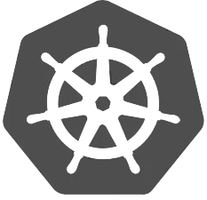

  

  
  
  
  

# 🚀 k8s-simplified

**k8s-simplified** is an open-source project that makes deploying apps to Kubernetes feel as simple as deploying to Vercel, Render, or Netlify — **but without the high cloud costs** ⚡.

Instead of paying for managed services (like AWS ECS/Fargate, Google Cloud Run, or Cloudflare Workers), you bring your own cloud (currently Google Cloud VMs) and k8s-simplified sets up everything for you automatically.

No Kubernetes knowledge required.  
No YAML configs.  
No DevOps stress.

Just ship your app 🚀.

👉 Helm Chart available here:  
[k8s-simplified Helm Chart](https://github.com/onukwilip/k8s-simplified/pkgs/container/k8s-simplified%2Fk8s-simplified)

---

## ✨ Why k8s-simplified?

Most developers face two deployment paths:

1. **Serverless / Managed Cloud Services** – Easy, but costs can skyrocket FAST! Up to hundreds to THOUSANDS of dollars!! (AWS ECS/Fargate, AWS Elastic Beanstalk, Azure App Service, Google Cloud Run, etc.).
2. **Self-managed open-source tools** – Cheaper, but requires painful setup and DevOps expertise (Docker Swarm, HashiCorp Nomad, complex Linux configs, manual autoscaling).

⚠️ Problem: These alternatives either get **too expensive** or **too complex to manage**. You’ll likely end up needing a DevOps engineer anyway.  
💡 Solution: **k8s-simplified** combines the flexibility of open-source with the ease of managed services.

Think **Heroku/Vercel vibes**, but on Kubernetes in _your own_ cloud 🌩️.

---

## ✨ What It Does

With k8s-simplified, you can deploy almost any kind of app:

- 🌐 **Web apps** (React, Next.js, Vue, etc.)
- ⚙️ **APIs** (Node.js, Django, Flask, etc.)
- 🗄️ **Databases** (Postgres, MySQL, MongoDB...Support coming soon :)
- 🔗 **Other workloads** (blockchain clients, workers, cron jobs…)

And once deployed, your app will:

✅ Scale up automatically when traffic surges  
✅ Scale down to save costs when traffic is low  
✅ Never go offline during updates  
✅ Store environment variables safely (via Kubernetes Secrets)

All while you focus on your code — not infrastructure.

---

## 🛠️ How It Works (Simple View)

Think of it like this:

1. We deploy a Web API which talks to the Kubernetes Cluster on your behalf. You tell it:

   - 📦 What app image to deploy
   - 🔑 What environment variables you need
   - 📏 What size your app should be (`dev`, `simple`, `medium`, `large`, `huge`, `intensive`)

2. k8s-simplified takes over:

   - Sets up a self-managed Kubernetes cluster on your Google Cloud VMs
   - Installs everything needed (ArgoCD, Helm, autoscalers, etc.)
   - Deploys your app with scaling, storage, and networking already handled

3. You get a running app that:
   - Can handle traffic spikes
   - Saves you money when idle
   - Stays online without downtime

That’s it! 🎉 No YAML, no Kubernetes knowledge needed.
It’s like Vercel/Render…but you’re in control of the cloud 😃.

---

## 🔑 Features

We deploy and manage a **Helm Chart** which automatically provisions the essential Kubernetes resources for your app:

- **Deployment** → Runs your container image & config.
- **Service** → Allows you to access your app (e.g., React app on port 3000).
- **Horizontal Pod Autoscaler (HPA)** → Scales pods horizontally during traffic spikes.
- **Vertical Pod Autoscaler (VPA)** → Dynamically adjusts CPU & RAM usage to reduce costs.
- **Pod Disruption Budget (PDB)** → Ensures high availability (no downtime during updates/scaling).
- **Secrets & Environment Variables** → Securely store and inject sensitive values (API keys, DB credentials, configs) into your app.

Together, these provide:

- The ability to **automatically support your growing customers** out of the box
- Help you **save money on Cloud expenses** by removing resources you don’t need
- Ensure **minimal to no downtime for your deployed apps** out of the box

---

## 🖥️ App Sizes

To make resource allocation simple, `k8s-simplified` defines **six preset application sizes**:

- `dev` → Minimal resources (great for testing/dev apps).
- `simple` → Small workloads (basic APIs, small apps).
- `medium` → Moderate workloads (APIs, web apps).
- `large` → Heavy workloads (streaming apps, larger APIs).
- `huge` → Very resource-intensive apps.
- `intensive` → Compute-heavy workloads.

💡 If your app needs more or fewer resources, the **VPA** will automatically adjust them.

---

## 🧪 Proof of Concept

To test the idea, we started with:

- ✅ A Minikube cluster
- ✅ Installed ArgoCD
- ✅ Built a Node.js + TypeScript Web API that talks to ArgoCD
- ✅ Successfully deployed an app on Kubernetes using **just the API** 🎉

Now, the Helm Chart automates everything: Deployments, scaling, secrets, networking, and high availability.

---

### 🎯 Goal

Make **Kubernetes invisible** for developers, startups, and solopreneurs —  
so they can deploy production-ready apps on their own cloud, without the headaches of learning infrastructure.

---

## 🌍 Bring Your Own Cloud

Unlike managed services (AWS ECS, Google Cloud Run, etc.),  
**you bring your own infrastructure** — starting with **Google Cloud VMs**.

The GitHub Actions pipeline (coming soon) will:

- Provision VMs, disks, and load balancers using **Terraform**
- Install Kubernetes + ArgoCD
- Deploy the **k8s-simplified Web API**

This means you only pay for **VMs, disks, and load balancers** — no expensive managed services.

---

## 🤝 Contributing

We’re preparing for **Hacktoberfest 🎃** — and `k8s-simplified` will be one of the supported repos!  
That means contributors will get **swag + badges** for their efforts 🏅.

Ways to contribute:

- Improve the Helm Chart
- Add support for more workload types
- Help build the upcoming frontend UI
- Report bugs & suggest features

---

## 🚗 Roadmap

- [x] Web API (Node.js + TS)
- [x] Helm Chart with autoscaling + secrets + high availability
- [ ] Support for deploying and managing databases
- [ ] CI/CD pipeline to auto-create the cluster on YOUR OWN Google Cloud infrastructure
- [ ] Frontend UI for an even smoother developer experience
- [ ] Multi-cloud support (AWS, Azure, etc.)
- [ ] Open source contributions (Hacktoberfest incoming 😉🎁)

---

## 📍 Links

- 📦 Helm Chart Package: [k8s-simplified on GitHub Packages](https://github.com/onukwilip/k8s-simplified/pkgs/container/k8s-simplified%2Fk8s-simplified)
- 🧑‍💻 Repo: [Here](https://github.com/onukwilip/k8s-simplified)!

---

## 📜 License

MIT License © 2025 Prince Onukwili
